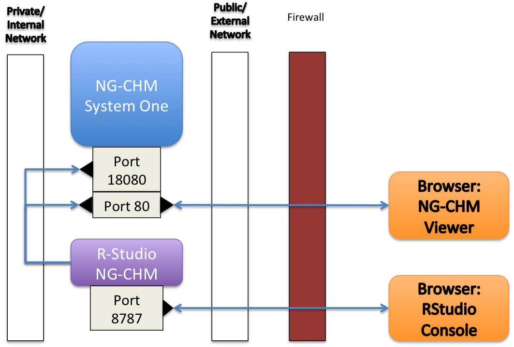

# ngchm-system-one

This repository contains a docker-compose file for creating a managed [Next-Generation Clustered Heat Map (NG-CHM)](http://bioinformatics.mdanderson.org/main/NG-CHM:Overview) system.  The system includes both an NG-CHM viewer and an NG-CHM manager.  The manager and viewer listen on different ports to facilitate simple access control to the manager interface.

## Usage

Clone this repository to a machine running [Docker](https://www.docker.com/) version 10 or higher and [Docker Compose](https://docs.docker.com/compose/) version 1.6.2 or higher.  We suggest a machine with at least four CPUs and four gigabytes of memory.

The system uses a named docker volume to store uploaded NG-CHMs:
```bash
$ docker volume create --name=chmData
```

Cd into the repository and start the docker containers:
```bash
$ cd ngchm-system-one
$ docker-compose up -d
```
The containers will publish the viewer interface on port 80 and the manager interface on port 18080.

In a cloud environment you might need to enable access to those ports.

## Creating NG-CHMs

This system is designed to be a central hub for storing/viewing NG-CHMs created on client machines. It does not include an integrated builder interface.

A [demonstration RStudio-based system](https://github.com/bmbroom/rstudio-isb-ngchm-demo) with the NGCHM R library preinstalled is available on github.

The two systems would be connected as diagrammed below:



We recommend running this system and the RStudio system on different machines.  Although you can run both on a single machine,
NG-CHM viewer performance will be adversely impacted by concurrent heavy computation in the RStudio container.

A larger configuration can have multiple instances of the NG-CHM system and/or the RStudio system (running on separate machines).
